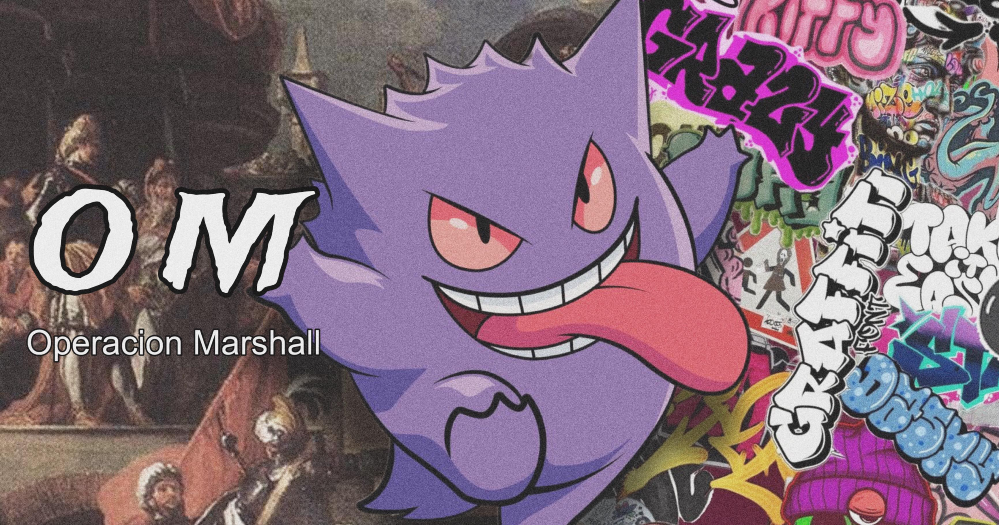

## Krampus-BOT 👻

<div align="center">
 
  
  
  </div>
  
# ━━━━━━━⛥ 𝗢𝗠 ༴༎👻༎ ⛦━━━━━━━
Una idea generada por un grupo de amigos (OM, *Operación Marshall*) al conjunto de *Krampus B.*

# ━━━━━━━━━━━━━━━━━━
# <span style="color:blue">༴༎TELEGRAM</span>


https://t.me/krampusiano
# <span style="color:green">༴༎CANAL DE WHATSAPP</span>
https://whatsapp.com/channel/0029Vap2vVA3QxRxY4ZuD00k
# ━━━━━━━⛥ 𝗢𝗠 ༴༎👻༎ ⛦━━━━━━━
# Instalación

TERMUX

1 - Abre termux y ejecuta este script

```
pkg upgrade -y && pkg update -y && pkg install git -y
```

2 - Da acceso al almacenamiento

```sh
termux-setup-storage
```

3 - Clona el repositorio
```sh
https://github.com/Barryalitiko/KrampusBotKram.git
```


